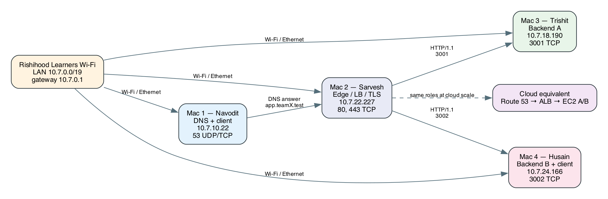
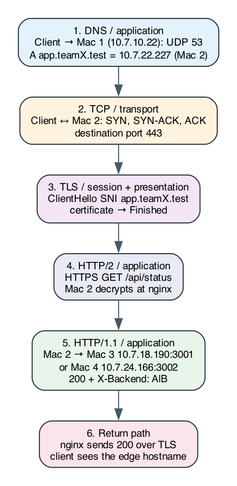

# CN Project Phase 1 - Team Architecture (`teamX`)

## 1. System purpose

This project demonstrates a small private-network service built from four Macs:
private DNS, an HTTPS edge and load balancer, and two HTTP backends. A client
resolves a team hostname, connects securely to the edge, and receives a
response from one of the backends. The design models private DNS, an
application load balancer, and two application-server targets in a cloud
system.

All four Macs participate in the same system. Mac 4 also acts as a convenient
client and packet-capture vantage because its DNS queries cross the LAN to
Mac 1; that capture role does not change the shared architecture.

## 2. Team roles and services

| Mac   | Owner   | Team responsibility                                                                            | Main service             |
| ----- | ------- | ---------------------------------------------------------------------------------------------- | ------------------------ |
| Mac 1 | Navodit | Private DNS, DNS client checks, DNS failure demos                                              | `dnsmasq`, UDP/TCP 53    |
| Mac 2 | Sarvesh | Edge proxy, round-robin load balancing, TLS and team CA                                        | `nginx`, TCP 80/443      |
| Mac 3 | Trishit | Backend A, shared backend implementation, caching design                                       | Python backend, TCP 3001 |
| Mac 4 | Husain  | Backend B, second client, client-side load-balancing checks, protocol capture, wrong-port demo | Python backend, TCP 3002 |

The backend source is shared: the same `server.py` runs as A or B, selected
with environment variables. Each team member owns their assigned service and
supports the integration checks needed by the full request path.

## 3. Network topology

Editable source: [topology.dot](topology.dot). The four Macs must share one
private LAN. Mac 1 provides DNS, Mac 2 is the only HTTPS edge, and Mac 3 and
Mac 4 are the two upstream application servers. Clients connect to the edge by
hostname rather than selecting a backend directly.

## 4. Shared IP and service table

| Mac   | Person  | Role               | Interface | IPv4            | Prefix / mask         | Gateway          | MAC address         | Listening ports |
| ----- | ------- | ------------------ | --------- | --------------- | --------------------- | ---------------- | ------------------- | --------------- |
| Mac 1 | Navodit | DNS + client       | `en0`     | `10.7.10.22`  | `/19 (255.255.224.0)` | `10.7.0.1` | `10:9f:41:bc:ff:5a` | `53 UDP/TCP`    |
| Mac 2 | Sarvesh | Edge / LB / TLS    | `en0`     | `10.7.22.227` | `/19 (255.255.224.0)` | `10.7.0.1` | `3a:33:4b:89:be:dc` | `80, 443 TCP`   |
| Mac 3 | Trishit | Backend A          | `en0`     | `10.7.18.190`  | `/19 (255.255.224.0)` | `10.7.0.1` | `be:4f:1d:91:b1:8b` | `3001 TCP`      |
| Mac 4 | Husain  | Backend B + client | `en0`     | `10.7.24.166` | `/19 (255.255.224.0)` | `10.7.0.1` | `6e:5a:77:e4:01:0c` | `3002 TCP`      |

Values recorded on the Rishihood Learners network on 28 September 2026.
Mac 2's IPv4, `/19` prefix (`255.255.224.0`), gateway `10.7.0.1` and MAC come
from its own `ifconfig en0` and `route -n get default`. The other three MAC
addresses are the active Wi-Fi addresses seen in Mac 2's ARP table
(`arp -n <IP>`); each owner should confirm theirs with `ifconfig en0`.
Recheck all values if any Mac rejoins or changes network.
The full editable table and collection commands are in [ip_table.md](ip_table.md).

## 5. Components and request path

Diagram sources: [request_flow.mmd](request_flow.mmd) and
[request_flow.dot](request_flow.dot).

1. **DNS:** A client asks Mac 1 for `app.teamX.test` using UDP 53. Mac 1 returns
   an A record for Mac 2; the expected DNS TTL is 60 seconds.
2. **TCP:** The client opens a connection from an ephemeral source port to
   Mac 2 on TCP 443 using the SYN, SYN-ACK, ACK handshake.
3. **TLS:** The client sends SNI `app.teamX.test`. Nginx presents the team
   certificate and negotiates TLS; clients trust the team's root CA. ALPN can
   negotiate HTTP/2 on the client-to-edge connection.
4. **HTTP at the edge:** The client sends `GET /api/status` over HTTPS. Nginx
   terminates TLS and forwards the request over HTTP/1.1 to one backend.
5. **HTTP at the backend:** Nginx selects Mac 3:3001 or Mac 4:3002. The
   backend returns JSON with `X-Backend`; Nginx passes it to the client over
   the TLS connection. `X-Upstream-Addr` identifies the backend address used.

## 6. Load balancing, caching, and availability

Nginx distributes requests across Backend A and Backend B using round-robin
selection. Repeated status requests should show both `X-Backend: A` and
`X-Backend: B`. If one backend stops responding, Nginx should retry the other
and continue serving successful requests. If both backends are unavailable,
the edge returns HTTP 502.

`/api/status` is marked `Cache-Control: no-store`, so each load-balancing
request reaches an upstream. `/api/cached` returns the same representation
and ETag from both backends, with `Cache-Control: public, max-age=60`. A
conditional request with a matching `If-None-Match` receives `304 Not Modified`.

### Edge configuration (Mac 2)

Mac 2 runs nginx 1.31.6 with `worker_processes 1`, so one round-robin counter
alternates cleanly between the backends. The full config is
[nginx-teamX.conf](../02_config/nginx-teamX.conf).

| Item | Value |
| --- | --- |
| Upstream `teamX_backends` | `10.7.18.190:3001` (A), `10.7.24.166:3002` (B), round-robin |
| Failover | `max_fails=1 fail_timeout=10s`, `proxy_next_upstream error timeout http_502 http_503`, `proxy_connect_timeout 2s` |
| Port 80 | `301` redirect to HTTPS |
| Port 443 | TLS 1.2 and 1.3, HTTP/2 via ALPN, names `app.teamX.test` and `api.teamX.test` |
| Upstream hop | HTTP/1.1 inside the LAN with `Host`, `X-Real-IP`, `X-Forwarded-For`, `X-Forwarded-Proto` |
| Response headers | `X-Edge: mac2-nginx`, `X-Upstream-Addr` (backend that answered) |
| Access log | `teamX_access.log` records `upstream=<addr> (<status>)` and request time |

| Certificate | Details |
| --- | --- |
| `teamX Local Root CA` | RSA 4096, SHA-256, 365 days, `CA:TRUE`, `keyCertSign, cRLSign` |
| `app.teamX.test` | RSA 2048, SHA-256, 365 days, SAN `app.teamX.test` and `api.teamX.test`, EKU `serverAuth` |

Generation, trust and validation steps are in
[tls_setup_notes.md](../02_config/tls_setup_notes.md).

## 7. TLS and network security

The team CA signs the edge certificate for `app.teamX.test`. Each client trusts
the public root CA certificate and validates HTTPS by hostname. The CA private
key stays with the edge owner and is not distributed to clients. The HTTPS
proof must work without `curl -k`.

The backends bind to `0.0.0.0` on their assigned ports so Mac 2 can reach them
across the LAN. The edge forwards the original client address in
`X-Forwarded-For`; the backend's TCP peer is Mac 2 because Nginx opens a
separate upstream connection.

## 8. Failure demonstrations

The team demonstrates failures at different layers and restores the working
configuration after each one:

- **DNS failure:** a wrong or missing DNS record prevents the hostname from
  resolving to the edge.
- **Wrong destination port:** the hostname resolves and Mac 2 is reachable,
  but connecting to an unused port such as 8444 receives a prompt TCP reset.
- **Backend failure:** stopping one backend tests Nginx failover; stopping both
  produces HTTP 502 while the edge remains reachable.

## 9. Team verification and evidence

The complete system is ready for the review when all of these checks pass:

- The four Macs share the private LAN, their IP table is complete, and the
  ping mesh succeeds.
- Mac 2 can reach both `http://10.7.18.190:3001/api/status` and
  `http://10.7.24.166:3002/api/status`.
- Clients use Mac 1 for DNS and receive Mac 2's address for `app.teamX.test`.
- HTTPS succeeds by hostname without `-k`, and repeated requests identify
  both backends.
- The cache revalidation, backend failover, and assigned failure demos work.
- The evidence folder contains the client outputs, screenshots, and Wireshark
  `.pcapng` captures. The full protocol-flow capture is made on Mac 4's `en0`;
  TLS 1.2 is used to show the certificate message in clear text.

Replace `teamX` with the assigned team name and verify all recorded network
values before submission. Evidence files should be marked complete only after
they are captured on the live project network.
